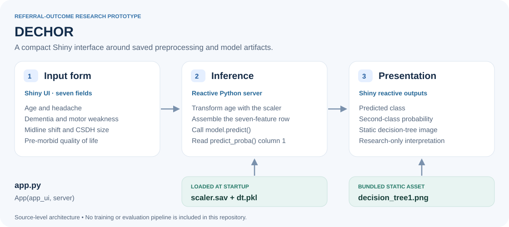

# DECHOR

**A decision-tree referral-outcome research prototype for chronic subdural haematoma.**

DECHOR stands for **Decision trEe for Chronic subdural HematOma Referral outcome prediction**. This repository contains a compact Python Shiny interface that collects seven inputs, applies a saved age scaler and calls a stored model to display its predicted class and a class-probability output.

The project demonstrates an interactive interface around a persisted machine-learning model. It is a **research prototype**, not a validated clinical decision tool. Its output should not be used to determine referral acceptance, treatment or patient care.

## At a glance

- **Interface:** Shiny for Python
- **Data transformation:** NumPy and pandas, with a saved age scaler
- **Inference:** serialized model calls to `predict()` and `predict_proba()`
- **Presentation:** reactive prediction text and a bundled decision-tree image
- **Repository scope:** inference interface and saved artifacts; no training dataset or training/evaluation pipeline is included

## Architecture



The application lives in [`app.py`](app.py). Its UI and server are combined as `App(app_ui, server)`:

1. The form collects age and six categorical inputs.
2. The server transforms age with the loaded scaler and assembles the features in the order expected by the source code.
3. The loaded model returns a predicted class and `predict_proba(... )[:, 1]`.
4. Shiny renders the text result alongside the static `decision_tree1.png` image.

The diagram describes the source-level flow. It is not evidence that the saved model, dependency versions or complete application have been independently validated.

## Inputs and output contract

| Input | Encoding in the form |
| --- | --- |
| Age | Slider from 0 to 100; transformed by the saved scaler |
| Headache | No = 0, Yes = 1 |
| Dementia | No = 0, Yes = 1 |
| Motor weakness | No = 0, Yes = 1 |
| Midline shift | No = 0, Yes = 1 |
| CSDH size | Small = 1, Medium = 2, Large = 3 |
| Pre-morbid quality of life | Reasonable = 0, Poor = 1 |

These are the application's input codes, not independently validated clinical definitions. In particular, the repository does not define measurement thresholds for the size categories or eligibility criteria for the age range.

The result text uses **Acceptance status** for `predict()` and **Prediction** for the second probability column. That column corresponds to the model's second class; the class ordering and label meaning must be verified against the original training specification before interpreting it as an acceptance probability. The displayed value is not documented here as a calibrated risk estimate.

## Repository guide

| File | Role |
| --- | --- |
| [`app.py`](app.py) | Shiny form, reactive server, feature assembly and inference calls |
| `dt.pkl` | Serialized model loaded by the application |
| `scaler.sav` | Serialized scaler applied to age |
| [`decision_tree1.png`](decision_tree1.png) | Static image displayed beside the model output |
| [`requirements.txt`](requirements.txt) | Historical pinned Python environment, including Shiny 0.2.5 and scikit-learn 1.1.2 |
| [`Procfile`](Procfile) | Empty deployment placeholder |

## Local inspection and historical setup

Read `app.py` before launching it. **Importing the application loads both serialized artifacts with `pickle`.** Only run artifacts whose provenance you trust: pickle deserialization can execute arbitrary code, and cross-version model loading is not supported by scikit-learn. See the [model-persistence guidance](https://scikit-learn.org/stable/model_persistence.html).

For trusted artifacts, a historical-environment reconstruction starts from the repository root in an isolated environment:

```bash
python -m venv .venv
# Activate .venv using the command appropriate to your shell.
python -m pip install -r requirements.txt
shiny run app.py
```

Keep `dt.pkl`, `scaler.sav` and `decision_tree1.png` in the repository root. The pickle paths are relative to the working directory. Consult [Shiny's local-running documentation](https://shiny.posit.co/py/get-started/create-run.html) for the CLI workflow.

The checked-in requirements are a broad historical environment snapshot, not a current deployment recommendation. Python/platform compatibility, dependency security and the complete inference path still need verification. These commands are a reconstruction guide, not a claim of a successful fresh install or a tested launch. Use synthetic inputs for exploration and keep any test server local.

## Research and reproducibility boundaries

- **Training provenance is not recorded here.** The repository does not include the cohort definition, training code, preprocessing fit procedure, feature dictionary or training/validation split.
- **Performance is not established by this repository.** No evaluation report, calibration analysis, external-validation results or subgroup analysis accompanies the interface.
- **The input contract needs verification.** Confirm the age transform, categorical codes, feature order, class labels and array shapes against the original model specification before evaluating outputs.
- **Deployment controls are incomplete.** The source does not provide an authentication, audit or governed clinical-data workflow, and the `Procfile` does not define a deployment command.
- **Clinical use requires separate evidence and governance.** A model prediction is not a referral policy or a treatment recommendation. Do not enter identifiable patient information into an unreviewed deployment.

The next reproducibility step is to pair the interface with a documented training specification, a trusted artifact manifest and synthetic-input tests. This README describes only the implementation present in this repository; it does not assert institutional endorsement or clinical readiness.
